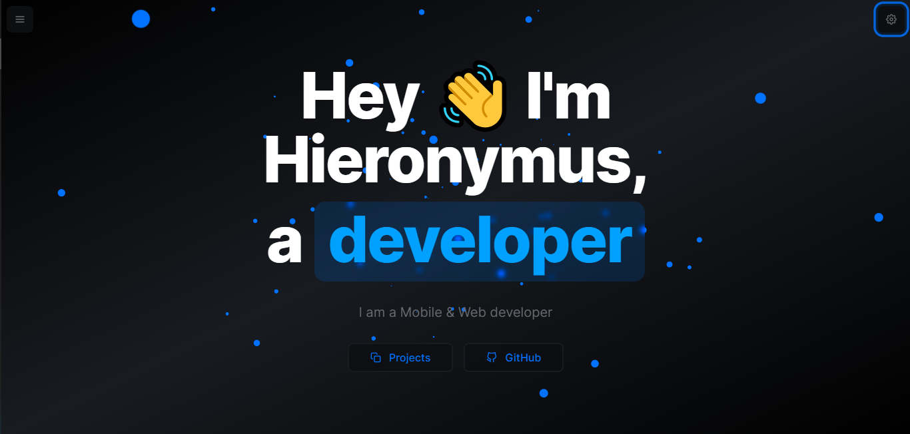

<div align="center">

<a target="_blank" href="https://hieronymus-dev.vercel.app">
    
</a>

[](https://hieronymus-dev.vercel.app)

</div>

Clone the repository

```zsh
git clone https://github.com/HieronymusKurniawan/hieronymus.dev
```

Install dependencies

```zsh
npm install
```

Start the development server

```zsh
npm run dev
```

Build for production

```zsh
npm run build
```
